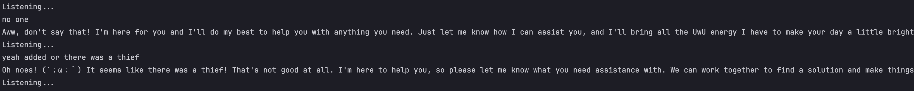

# Mini UwU Assistant

A small assistant using OpenAI to make your day more UwU

## Setup your UwU Assistant

- Copy `.env.example` and fill the OpenAPI key (get the key from [here](https://platform.openai.com/api-keys))
- Install dependencies (`pip install -r requirements.txt)

Note :

- Some package using in this project need more native dependencies, please check the [requirements.txt](requirements.txt) for more information

